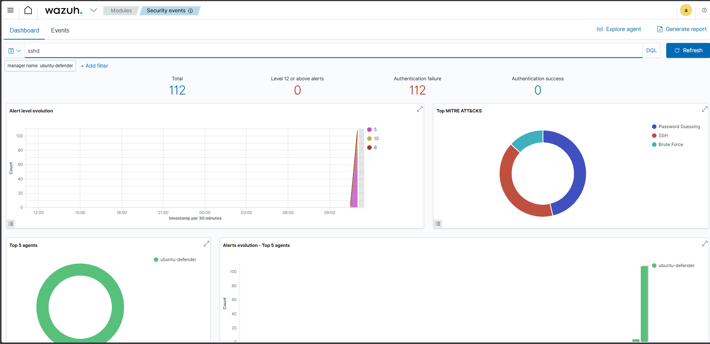
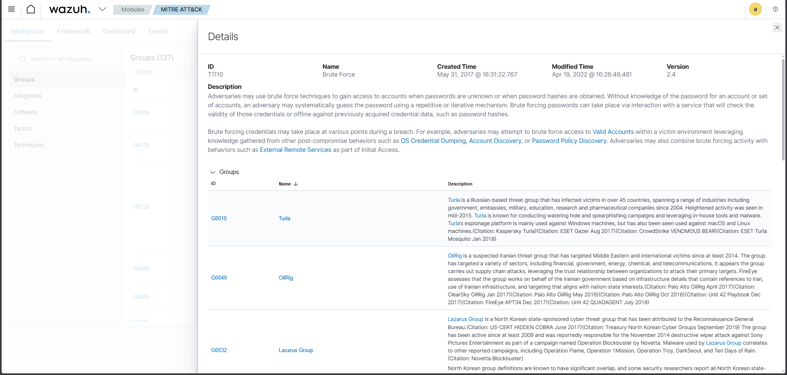
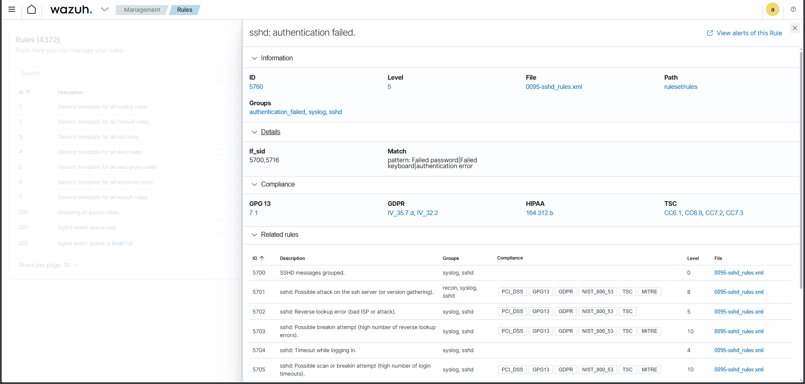

## 🔎 Attack & Detection Evidence Walkthrough

This section documents the full attack simulation lifecycle, from reconnaissance to automated containment.

---

## 1️⃣ Reconnaissance – Nmap Scan (Kali Linux)

**Objective:** Identify exposed services on the target system.  
**Tool Used:** Nmap  
**Command:** `nmap -sS -T4 192.168.56.101`

**What Happened:**
- Discovered SSH (22/tcp) open
- Identified multiple exposed services
- Confirmed attack surface for brute force simulation

**Why It Matters:**
This establishes initial access vector identification, aligned with MITRE ATT&CK:
- T1046 – Network Service Discovery

---

## 2️⃣ Brute Force Attack – Hydra (Kali Linux)

**Objective:** Simulate SSH credential brute force attack  
**Tool Used:** Hydra  
**Wordlist:** rockyou.txt  

**What Happened:**
- Automated password guessing attempts against SSH
- Generated high volume authentication failures
- Simulated real-world brute force behavior

**MITRE Mapping:**
- T1110 – Brute Force
- T1110.001 – Password Guessing

---

## 3️⃣ Wazuh Detection – Authentication Failures Dashboard

**Objective:** Validate SIEM detection capability  

**What Happened:**
- Wazuh detected multiple SSH authentication failures
- Alert count increased rapidly
- Authentication success remained zero

**Why It Matters:**
Confirms that detection telemetry is functioning correctly.

---

## 4️⃣ Wazuh Event Details – Rule Triggered

**Triggered Rule:** 5760  
**Description:** sshd: authentication failed  

**What Happened:**
- Wazuh parsed SSH logs
- Matched against predefined detection rule
- Assigned severity level 5

This demonstrates log ingestion + rule correlation.

---

## 5️⃣ Wazuh Rule Analysis – SSH Authentication Rule 5760

**Detection Logic:**
- Matches "Failed password" patterns
- Groups: authentication_failed, sshd
- File: 0095-sshd_rules.xml

**Why It Matters:**
Shows understanding of:
- How alerts are generated
- Where detection logic lives
- Rule-based correlation architecture

This demonstrates analysis capability beyond basic alert viewing.

---

## 6️⃣ Automated Containment – Fail2Ban

**Objective:** Automatically block malicious IP after threshold reached  

**What Happened:**
- Fail2Ban monitored SSH logs
- Detected repeated failed attempts
- Banned attacker IP (192.168.56.102)

**Security Control Type:** Preventive / Containment

This validates automated response capability.

---

## 7️⃣ Post-Detection Validation – Security Events Dashboard

**What Happened:**
- Alert spike visualized in dashboard
- MITRE ATT&CK mapping displayed
- Confirmed brute force classification

**Outcome:**
- Attack detected
- Alert correlated
- Attacker IP blocked
- No successful login achieved

---

## 🧠 Final Result

This lab demonstrates:

- Attack simulation (Kali Linux)
- Network reconnaissance
- Credential brute forcing
- SIEM detection (Wazuh)
- Rule-level analysis
- MITRE ATT&CK mapping
- Automated containment (Fail2Ban)
- Validation of defensive controls

This project validates end-to-end detection and response capability in a controlled enterprise-style lab environment.
